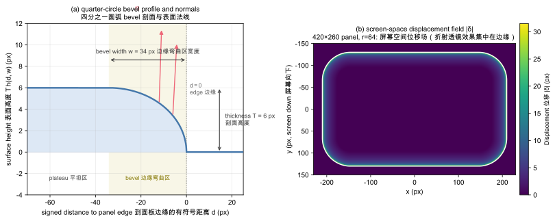
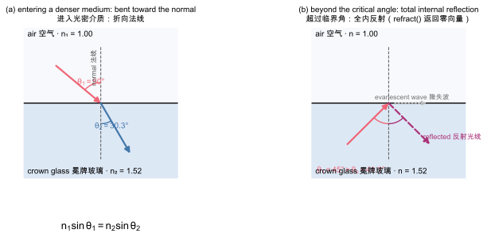
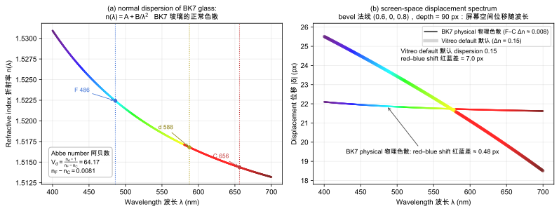
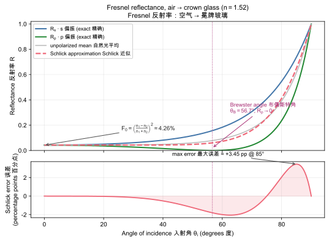

# The Optics of Vitreo

**A physical model for screen-space glass rendering**

*Vitreo Technical Report 1 · 2026-09-26 · Chinese translation: [optics.zh.md](optics.zh.md)*

---

## Abstract

Vitreo renders rectangular glass panels over arbitrary 2D backdrops using a single wgpu fragment pass. This document derives every equation the shader evaluates — the rounded-box signed distance field, the bevel height profile and its surface normals, Snell refraction turned into a screen-space displacement, chromatic dispersion from the Abbe number, and Schlick's approximation to the Fresnel reflectance — and justifies each physical constant against the literature. Every curve in the figures is computed by re-implementing the exact Rust/WGSL formulas in `docs/figures/generate.py`; nothing is drawn freehand. We close with the mapping from physics to the public `GlassStyle` parameters and with worked numerical examples.

**Keywords:** refraction, Snell's law, signed distance fields, chromatic dispersion, Abbe number, Fresnel equations, Schlick approximation, WGSL, wgpu

---

## 1. Introduction

### 1.1 Glass is a medium, not a texture

A physical pane of glass carries no image of its own. What you see *through* it and *on* it is entirely determined by light interacting with the background behind it and with the pane's two surfaces. That is the design axiom of Vitreo:

> **The optics are shared, the identity is local. Refraction is written once; the chrome is written per platform.**

A glass panel therefore takes exactly one mandatory input — the backdrop, as an ordinary RGBA texture (a static image, an offscreen render of the app's own scene, or a video frame) — and produces three optical phenomena that no matte "frosted" blur can reproduce:

1. **Refraction** — the background seen through the pane is displaced, and the displacement varies across the pane's edge;
2. **Dispersion** — the displacement differs per wavelength, fringing edges with spectral color;
3. **Fresnel reflection** — the pane's rim catches light and glows at grazing angles.

### 1.2 Pipeline overview

For each pixel inside a panel, the fragment shader (`vitreo/src/glass.wgsl`) evaluates:

```
sdRoundedBox SDF → bevel height field → surface normal
  → refract() → screen-space displacement (per wavelength)
  → Schlick–Fresnel edge glow + specular highlight
```

The same math exists twice on the CPU side — `vitreo/src/sdf2d.rs` and `vitreo/src/optics.rs` — as a parity oracle: its 31 unit tests pin the numerical behavior, and any drift between Rust and WGSL would silently change the shape of every panel.

### 1.3 Notation

| Symbol | Meaning | Where it appears |
|---|---|---|
| $n$ | refractive index (IOR) of a medium | §3 |
| $n_1, n_2$ | IOR of the incident / transmitting medium | §3.2 |
| $\eta$ (eta) | ratio $n_1 / n_2$ fed to WGSL `refract` | §3.3 |
| $d$ | signed distance from the panel edge (negative inside) | §2 |
| $w$ | bevel width in px | §2.2 |
| $T$ | bevel profile height (thickness) in px | §2.2 |
| $D$ | optical path depth in px | §3.4 |
| $V_d$ | Abbe number | §4 |
| $F$ | Fresnel reflectance | §5 |

Coordinates are physical pixels with the origin at the viewport's top-left and $y$ pointing down, matching both the wgpu framebuffer and the winit cursor.

---

## 2. Geometry: from rounded box to surface normal

### 2.1 The rounded-box SDF

A **signed distance field** (SDF) is a function that returns, for any point $p$, the distance to the nearest surface — negative inside, positive outside, zero exactly on the contour. SDFs are the lingua franca of procedural geometry because distances compose and anti-aliasing falls out for free. Vitreo uses Inigo Quilez's exact formula for a 2D rounded box, implemented verbatim in `sdf2d.rs::sd_rounded_box` and `glass.wgsl::sd_rounded_box`:

$$
\begin{aligned}
q &= |p| - b + r \\
d(p) &= \min(\max(q_x, q_y), 0) + \lVert \max(q, 0) \rVert - r
\end{aligned}
\tag{2.1}
$$

where $b$ is the box **half-size** and $r$ the corner radius. The two terms split the plane into the interior ($\max(q_x,q_y)<0$: axis-aligned distance), the exterior near edges and corners (Euclidean distance), and the exterior far out (Euclidean distance). Three unit tests pin the behavior: $d = -b_y$ at the center, $d = 0$ on the edge, and $(\sqrt2 - 1)\,r$ at a corner — the corner point is exactly $r$ away from the quarter-circle.

### 2.2 The bevel height profile

A flat slab would bend light only where its surface tilts. The "liquid glass" look comes from a **bevel**: a narrow band of width $w$ along the contour where the surface rises from the edge into the interior, modeled as a quarter circle of height $T$ (the profile *thickness*). `sdf2d.rs::glass_height` maps signed distance to normalized height:

$$
h(d, w) = \sqrt{1 - t^2}, \qquad t = 1 - \operatorname{clamp}\!\left(\frac{-d}{w}, 0, 1\right)
\tag{2.2}
$$

Reading it inside-out: $-d/w$ is 0 at the edge and 1 at $w$ pixels inward; $t$ runs the other way (1 at the edge → 0 inward); $1 - t^2$ sweeps a quarter circle; the square root completes it. So $h = 0$ at the edge, $h = 1$ on the flat **plateau** ($d \le -w$), and between them $h$ traces $\sqrt{1-t^2}$ — exactly the upper-right quadrant of a unit circle traversed from its pole to its equator. Outside the panel ($d > 0$) the clamp yields $h = 0$ as well, which matters because the normal field (§2.3) is evaluated a pixel or two beyond the silhouette for anti-aliasing.

The physical surface height is $z(p) = T \cdot h(d(p), w)$ — the height field of Figure 4(a).

> **Why a quarter circle?** A circular arc meets the plateau tangentially (slope 0 — no visible seam) and meets the edge vertically (slope ∞ — maximum bending right at the rim, where Apple-style glass shows its strongest lensing). A linear chamfer has slope discontinuities at both ends; a quarter circle has continuous slope at the plateau and unbounded slope density at the edge. One parameter ($w$) then controls the character: small $w$ reads as a hard glass slab, large $w$ as a soft droplet.

### 2.3 Surface normals by finite differences

The shader needs the unit normal $\mathbf{n}$ at every pixel. Rather than deriving an analytic derivative of the composed field, both the Rust oracle and the WGSL use central differences of the height field with $\varepsilon = 1$ px (`sdf2d.rs::glass_normal`):

$$
\begin{aligned}
h_x &= h\big(d(p + \varepsilon\hat{x})\big) - h\big(d(p - \varepsilon\hat{x})\big), \quad
h_y = h\big(d(p + \varepsilon\hat{y})\big) - h\big(d(p - \varepsilon\hat{y})\big)\\[4pt]
\mathbf{n} &= \frac{\left(-\dfrac{T}{2\varepsilon}h_x,\; -\dfrac{T}{2\varepsilon}h_y,\; 1\right)}{\left\lVert\cdot\right\rVert}
\end{aligned}
\tag{2.3}
$$

The factor $T/(2\varepsilon)$ scales the finite-difference slope into actual pixel height — this is where the *thickness* parameter enters. On the plateau $h_x = h_y = 0$ and $\mathbf{n} = (0,0,1)$: no bending, the backdrop is sampled unshifted. On the bevel the in-plane components grow, tilting the normal outward. Unit tests assert: unit length everywhere including corners and outside, symmetry across the axes, flatness on the plateau, and a monotone tilt as $T$ grows.

> **Why finite differences instead of analytic gradients?** $\varepsilon = 1$ px matches the shader's pixel grid, costs 4 SDF evaluations, and is exactly reproducible on the CPU oracle. The trade-off — slight stair-stepping of the normal field at 1 px scale — is invisible after the displacement is applied to a smoothly sampled backdrop.



*Figure 4 — (a) The quarter-circle bevel profile $z = T\,h(d, w)$ for the default material ($w = 34$ px, $T = 6$ px), with surface normals (Eq. 2.3) tilting outward as the edge approaches. (b) Screen-space displacement magnitude $\lVert\boldsymbol{\delta}\rVert$ (Eq. 3.5) for a 420×260 panel with $r = 64$: exactly zero on the plateau, swelling in a ring along the bevel and peaking at 31.52 px where the corner bevel is steepest. All values computed by a direct NumPy re-implementation of the shader math (`docs/figures/generate.py`).*

---

## 3. Refraction: Snell's law as a pixel offset

### 3.1 Refractive index

The **refractive index** (index of refraction, IOR) $n$ of a medium is the ratio of the speed of light in vacuum to its phase speed in that medium, $n = c / v$. It measures optical density: light slows and the wavefront pivots when crossing into a higher-$n$ material. $n$ is a genuine material constant, not a stylization knob — Vitreo ships the physics table in `optics.rs`:

| Medium | $n$ | Notes |
|---|---|---|
| Air | 1.000 | vacuum ≈ 1 by convention here |
| Water | 1.333 | |
| Acrylic (PMMA) | 1.490 | the "glass" of real UI hardware |
| Crown glass | **1.520** | Vitreo's default; classic optical crown |
| Sapphire | 1.770 | watch crystals |
| Diamond | 2.417 | extreme bending + strong dispersion |

### 3.2 Snell's law

When light crosses an interface between media $n_1 \to n_2$, the ray direction pivots according to **Snell's law** (Figure 1a):

$$
n_1 \sin\theta_1 = n_2 \sin\theta_2
\tag{3.1}
$$

Entering a denser medium ($n_2 > n_1$), the ray bends *toward* the normal ($\theta_2 < \theta_1$): at 50° from air into crown glass, the transmitted angle is $\arcsin(\sin 50° / 1.52) = 30.26°$ (Figure 1(a)).

Going the other way, there is a **critical angle** beyond which no transmission exists:

$$
\theta_c = \arcsin\frac{n_1}{n_2} \quad (n_1 > n_2)
\tag{3.2}
$$

For crown glass → air, $\theta_c = 41.14°$. Beyond it the wave cannot propagate into the second medium and **total internal reflection** (TIR) returns all the energy inward (Figure 1(b)); the field technically continues as a non-propagating **evanescent wave** hugging the interface. Fiber optics and diamond sparkle are this effect.



*Figure 1 — Snell's law at a dielectric interface. (a) Air → crown glass ($n = 1.52$): a 50° incidence refracts to 30.26°, bending toward the normal (Eq. 3.1). (b) Crown glass → air beyond the critical angle $\theta_c = 41.14°$ (Eq. 3.2): no real transmission angle exists, the energy is totally internally reflected, and only an evanescent wave (dotted) grazes the interface. The shader experiences (b) as `refract()` returning the zero vector (§3.3).*

### 3.3 The WGSL `refract` convention

The GPU built-in used by the shader — and mirrored by `optics.rs::refract` — is:

$$
\operatorname{refract}(\mathbf{I}, \mathbf{N}, \eta), \qquad \eta = \frac{n_1}{n_2}
\tag{3.3}
$$

with $\mathbf{I}$ the unit incident direction *pointing at* the surface, $\mathbf{N}$ the unit normal *pointing toward* the incident side, and

$$
\mathbf{R} = \eta \mathbf{I} - \left(\eta\,(\mathbf{N}\!\cdot\!\mathbf{I}) + \sqrt{1 - \eta^2 (1 - (\mathbf{N}\!\cdot\!\mathbf{I})^2)}\right)\mathbf{N}
\tag{3.4}
$$

The square-root term is the discriminant of Snell's law; when it goes negative ($\eta^2(1 - \cos^2\theta_i) > 1$) there is no real solution — TIR — and the built-in returns the zero vector. The unit tests pin all three regimes: unbent at normal incidence, $\sin\theta_2 = \eta \sin\theta_1$ at oblique incidence, zero vector past the critical angle.

### 3.4 From ray to pixels: the screen-space displacement

Real cameras look through glass at an angle; a UI camera looks **orthogonally through the screen**, $\mathbf{I} = (0, 0, -1)$, at a surface whose normal $\mathbf{n} = (n_x, n_y, n_z)$ is almost $(0,0,1)$. Applying Eq. (3.4) and propagating the refracted ray until it has traversed an optical path of $D$ pixels **measured along the view axis**, the ray's lateral drift per unit depth is $R_{xy} / |R_z|$, so the sampled background pixel is displaced by (`optics.rs::refract_offset_px`, `glass.wgsl::refract_offset`):

$$
\boldsymbol{\delta} = \frac{D}{|R_z|}\,\mathbf{R}_{xy} \quad\text{where } \mathbf{R} = \operatorname{refract}\big(\mathbf{I}, \mathbf{n},\, n_1/n_2\big)
\tag{3.5}
$$

The $|R_z|$ denominator converts path length along the (mostly axial) ray into depth along the view axis. For air→glass refraction ($\eta < 1$, no TIR possible) $|R_z|$ is bounded between roughly $\eta$ and 1, so the division is always well-conditioned; the $1\,\mathrm{e}{-3}$ floor in the code is a defensive guard for hypothetical $\eta > 1$ configurations, not a working-path necessity.

Displacement grows **linearly in $D$** (test-pinned) and **monotonically in the IOR contrast**. With the canonical bevel normal $(0.6, 0, 0.8)$ and $D = 90$ px:

| Material | $n$ | $\lVert\boldsymbol{\delta}\rVert$ |
|---|---|---|
| Water | 1.333 | 16.06 px |
| Crown glass | 1.520 | 21.81 px |
| Diamond | 2.417 | 37.27 px |

> **`thickness` vs `depth`: two different physical quantities.** $T$ (thickness, §2.2) is the *height* of the bevel cross-section — it shapes the normals, i.e. *where* and *how steeply* the surface tilts. $D$ (depth, §3.4) is the *optical path* — it scales how far the tilted surface shifts the backdrop. A thin-but-deep pane smears a wide band; a thick-but-shallow one tilts hard but moves little. Both matter, and the UI exposes them separately for exactly this reason.

### 3.5 What the eye reads as "glass"

Equation (3.5) explains the whole Liquid-Glass gestalt. On the plateau $\boldsymbol\delta = 0$ — the backdrop shows through undistorted, "clear". Across the bevel the normal sweeps from vertical to grazing, so $\lVert\delta\rVert$ swells from 0 to tens of pixels and decays again: the rim acts as a ring of cylindrical lenses, compressing and stretching the background exactly where a physical bevel would (Figure 4(b)). Human vision, exquisitely tuned to how transparent solids *warp* edges, reads that warp — not any highlight — as "this is glass".

---

## 4. Dispersion: one eta per wavelength

### 4.1 Physical dispersion and the Abbe number

The refractive index of a dielectric depends on wavelength because light polarizes the material's bound electrons at the frequency of the wave; nearer an absorption resonance, the response strengthens. In the visible window — away from resonances — $n(\lambda)$ decreases monotonically with $\lambda$ (**normal dispersion**), well approximated over a bounded range by Cauchy's two-term equation:

$$
n(\lambda) = A + \frac{B}{\lambda^2}
\tag{4.1}
$$

For **BK7**, the workhorse borosilicate crown glass, fitting the $d$ line (587.6 nm, $n_d = 1.5168$) and the F/C spread gives $A = 1.504590$, $B = 0.004216\ \mu\text{m}^2$ (Figure 3(a)). Glassmakers catalog the strength of dispersion by the **Abbe number**:

$$
V_d = \frac{n_d - 1}{n_F - n_C}
\tag{4.2}
$$

where $F = 486.1$ nm (blue), $C = 656.3$ nm (red). *High* $V_d$ means *low* dispersion. BK7's $V_d = 64.17$, hence $n_F - n_C = (1.5168-1)/64.17 = 0.00805$ — less than one percent of IOR. `optics.rs::abbe_spread` implements exactly this inversion.



*Figure 3 — Chromatic dispersion. (a) Normal dispersion of BK7, $n(\lambda) = A + B/\lambda^2$ (Eq. 4.1) with $A = 1.504590$, $B = 0.004216\ \mu\text{m}^2$; the F (486 nm), d (588 nm) and C (656 nm) catalog lines define the Abbe number $V_d = 64.17$ (Eq. 4.2). (b) The same physics translated into screen space (Eq. 3.5, bevel normal $(0.6, 0, 0.8)$, $D = 90$ px): with the physical spread, red and blue sampling points land 0.48 px apart — honest, but invisible at UI scale; Vitreo's default $\Delta n = 0.15$ stretches the gap to 7.0 px (§4.3).*

### 4.2 Per-channel refraction in the shader

The shader loops over `SPECTRAL_SAMPLES = 3` probes spanning the F→C range, $\eta_i = 1 / (n_d + \Delta \cdot (t_i - 0.5))$ with $t_i \in \{0, \tfrac12, 1\}$ — note the blue end gets the *higher* index, bending more (test: blue displaces more than red). Each probe's displaced sample is weighted by a coarse tri-lobed **spectrum weight**

$$
w_k(t) = \exp\!\big(-16\,(t - \mu_k)^2\big), \quad \mu \in \{0.15, 0.50, 0.85\}
\tag{4.3}
$$

and the result is normalized per channel by the summed weights. Equal weights in, equal weights out: a neutral backdrop stays neutral, and only pixels where the three probes land on different backdrop colors show fringing.

### 4.3 The honest gap: physical vs artistic dispersion

Applied literally, Eq. (4.2) is almost invisible: through a bevel normal and $D = 90$ px, BK7's red–blue displacement difference is **0.48 px** (Figure 3(b), thin curve) — the thin-film honesty of real glass, and real UI glass *is* that subtle. Vitreo's default `dispersion = 0.15` — roughly 19× the BK7 spread — is an artistic choice inherited from the reference implementation, pushing the span to **7.0 px** so the spectral edge is legible at UI scale (Figure 3(b), thick curve). The `GlassStyle::bk7_dispersion()` constructor exists for the physically-correct setting; `dispersion = 0` shortcuts to a single `refract` evaluation.

> **Three samples are enough.** The backdrop is displaced *spatially*, not re-shaded spectrally; a 3-tap weighted average reproduces the visual ensemble (cyan-ish fringe inside, red-ish fringe outside) without the cost or noise of a true spectral integral. This is the same trade-off game engines make, and it is honest about being an approximation.

---

## 5. Fresnel: why glass edges glow

### 5.1 The exact Fresnel equations

At each interface, light splits into reflected and transmitted parts. Augustin-Jean Fresnel's equations give the exact reflectance for the two polarization states of dielectric interfaces:

$$
R_s = \left(\frac{n_1\cos\theta_i - n_2\cos\theta_t}{n_1\cos\theta_i + n_2\cos\theta_t}\right)^{2}, \qquad
R_p = \left(\frac{n_1\cos\theta_t - n_2\cos\theta_i}{n_1\cos\theta_t + n_2\cos\theta_i}\right)^{2}
\tag{5.1}
$$

with $\theta_t$ from Snell's law. Three regimes matter (Figure 2):

- **Normal incidence:** $R_s = R_p = \left(\frac{n_1-n_2}{n_1+n_2}\right)^2$. Air→crown glass: $((1-1.52)/2.52)^2 = 0.0426$ — a pane reflects ~4% per surface, the everyday look of window glass.
- **Brewster's angle** $\theta_B = \arctan(n_2/n_1) = 56.66°$: $R_p \to 0$ — p-polarized light transmits perfectly (polaroid sunglasses exploit this).
- **Grazing incidence** $\theta \to 90°$: both polarizations → 1. Every dielectric becomes a mirror at grazing angles — this, not tint, is why a glass rim catches light and glows.



*Figure 2 — Fresnel reflectance for air → crown glass ($n = 1.52$). Top: exact $R_s$, $R_p$ (Eq. 5.1) with Brewster's angle $\theta_B = 56.66°$ where $R_p \to 0$, the unpolarized mean, and Schlick's approximation (Eq. 5.2, dashed) anchored at $F_0 = 4.26\%$. Bottom: the approximation's deviation from the unpolarized exact mean stays within ±3.45 percentage points, peaking near 85° — imperceptible under the composite pass's specular lobe (§5.2).*

### 5.2 Schlick's approximation

Evaluating Eq. (5.1) per pixel costs two `atan`/`sqrt` chains plus branchy denominator guards. Christophe Schlick (1994) showed the whole family collapses to

$$
F(\cos\theta) \approx F_0 + (1 - F_0)\,(1 - \cos\theta)^5, \qquad F_0 = \left(\frac{n_1 - n_2}{n_1 + n_2}\right)^2
\tag{5.2}
$$

$F_0$ is the normal-incidence reflectance — the only material-specific quantity. The approximation is exact at $\theta = 0°$ and $\theta = 90°$ and deviates from the unpolarized exact mean by at most **+3.45 percentage points near 85°** for $n = 1.52$ (Figure 2, bottom subplot) — an error the eye cannot catch under a 48-px-exponent specular lobe. Vitreo implements `fresnel_schlick` identically in `optics.rs` and `glass.wgsl`, with `fresnel_f0` precomputed on the CPU per panel (`panel.rs`) so the shader never recomputes it.

### 5.3 Edge glow in the composite

The shader mixes the refracted backdrop toward a "sky" term by the Fresnel factor, with the light coming from above in the y-down screen frame:

$$
\text{sky} = \text{tint} \cdot (0.55 - 0.45\,n_y), \qquad
\text{color} = \operatorname{mix}(\text{refracted},\ \text{sky},\ F(\mathbf{n}\cdot\mathbf{v}))
\tag{5.3}
$$

Flat interior → $F \approx F_0 \approx 4\%$: the panel is essentially a window. Rim, where $\mathbf{n}$ turns grazing → $F \to 1$: the backdrop yields to the glow. The same $F_0 = 4.26\%$ that makes your window slightly mirror-like at night is what draws the luminous rim of a Liquid Glass panel — the physical model earns the aesthetic for free.

A **specular highlight** is layered on top: Blinn-Phong-style $\big(\mathbf{R}\cdot\mathbf{L}\big)^{48}$ against the key light direction $(-0.35, -0.72, 0.60)$ (y flipped into screen space), scaled by `specular = 0.85`. Physically this is the panes' second surface catching the "room light"; artistically it is the thin bright streak that sells curvature.

---

## 6. The composite pass: assembling the pane

Per pixel, `fs_main` walks the (up to 8) panels back-to-front, topmost last:

1. **Coverage.** $c = 1 - \operatorname{smoothstep}(-1, 1, d)$ turns the SDF into a 1-px anti-aliased silhouette; outside panels $c = 0$.
2. **Inside ($c > 0$):** shade via §3–§5, mix into the running color by $c$.
3. **Outside, if the panel casts a shadow:** an SDF soft shadow — the signed distance is offset by the shadow vector and ran through a `smoothstep` whose width is the shadow blur — darkens the backdrop without any extra render target.
4. **Backdrop blur** (frost) is a single trilinear `textureSampleLevel` at $\mathrm{LOD} = \log_2(\text{blur px})$: the mipmap chain acts as a precomputed Gaussian pyramid. Cheap, stable, and the reason the sampler is created with linear mipmaps.
5. **Tint** — optional color mix, doubling as the edge-glow color from §5.3. `tint_opacity = 0` keeps the glass purely optical.

Everything runs in linear light; the sRGB encode happens in the target format (`Bgra8UnormSrgb`), so the physical constants above are used unmodified.

---

## 7. From physics to API: `GlassStyle`

| Parameter | Physical quantity | Default | § |
|---|---|---|---|
| `ior` | refractive index $n$ | 1.52 (crown glass) | 3.1 |
| `bevel` | bevel width $w$ (px) | 34 | 2.2 |
| `thickness` | bevel profile height $T$ (px) | 6 | 2.2 |
| `depth` | optical path $D$ (px) | 90 | 3.4 |
| `dispersion` | F–C IOR spread $\Delta n$ (0 = off; `GlassStyle::bk7_dispersion()` = 0.008) | 0.15 (artistic) | 4 |
| `blur` | backdrop frost radius (px, mipmap LOD) | 0 | 6 |
| `specular` | key-light intensity | 0.85 | 5.3 |
| `tint` / `tint_opacity` | coloration & glow color | white / 0 | 6 |
| `shadow.*` | soft SDF shadow | off | 6 |

## 8. Validation

- **31 CPU unit tests** (`sdf2d.rs`, `optics.rs`, `panel.rs`) pin: Snell's law at oblique incidence, the zero vector past the critical angle, linear growth in $D$, monotone growth in IOR and in thickness, blue-bends-more-than-red, $F_0(\text{air, crown}) = 0.0426$, $\Delta n(\text{BK7}) = 0.00805$, Fresnel endpoints, uniform-layout invariants.
- **Figure parity.** All figures here are generated from a line-by-line NumPy transcription of the Rust/WGSL formulas (`docs/figures/generate.py`); re-run `.venv/bin/python docs/figures/generate.py` after any optics change and diff.
- **Worked examples** (recomputed on every figure run): 50° → 30.26° (air→glass); $\theta_c = 41.14°$, $\theta_B = 56.66°$; $F_0 = 4.26\%$; displacement at $(0.6,0,0.8)$, $D=90$: 16.06 / 21.81 / 37.27 px (water / crown / diamond); red–blue displacement span 0.48 px (BK7) vs 7.0 px (default 0.15).

## 9. References and attribution

1. **m2-md, *liquid-glass-refraction-shader*** (MIT) — the origin of the optics/sdf math and of the thickness/bevel/refraction/blur/specular uniform split; `optics.rs` and `sdf2d.rs` are ports of its `optics.ts` / `sdf2d.ts` with tests. <https://github.com/m2-md/liquid-glass-refraction-shader>
2. **jeantimex, *glass-effect-webgpu*** (MIT) — the WGSL pipeline structure (uniform layout, composite pass organization). <https://github.com/jeantimex/glass-effect-webgpu>
3. I. Quilez, *2D distance functions* — the exact rounded-box SDF. <https://iquilezles.org/articles/distfunctions/>
4. C. Schlick, "An Inexpensive BRDF Model for Physically-based Rendering", *Computer Graphics Forum* 13(3), 1994 — Eq. (5.2).
5. *RefractiveIndex.INFO* — IOR table values. <https://refractiveindex.info/>
6. **heonny, *egui-glass*** (live-backdrop offscreen pipeline, P2 reference); **zaroutt, *Niri-glass*** and **OverShifted, *LiquidGlass*** (compositor-level SDF refraction references).

All of the above are MIT-licensed; Vitreo is MIT-licensed (see `LICENSE`). This document and all figures are original work for the Vitreo project.

---

*Vitreo — write once, refract everywhere.*
